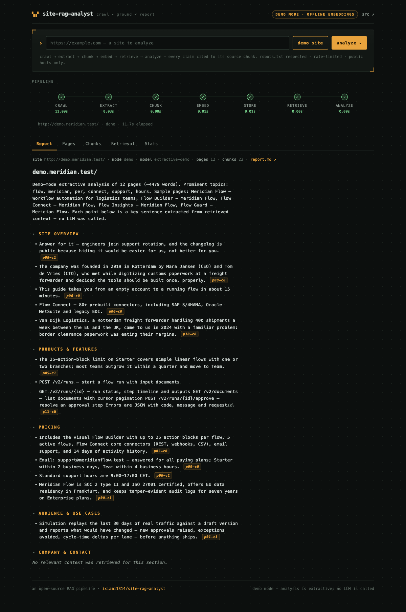
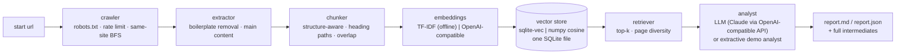

# site-rag-analyst

**Crawl a website, ground an LLM in it, get a structured report where every claim cites its source chunk.**

[](https://github.com/ixiami1314/site-rag-analyst/actions/workflows/ci.yml)


A compact, self-contained RAG pipeline for website analysis:

```
crawl → extract → chunk → embed → store → retrieve → analyze → cited report
```

It is the kind of system that sits behind "ingest our site into an
AnythingLLM workspace and analyze it" engagements — built here as one
readable repo: every stage is independently testable, every intermediate
artifact is inspectable, retrieval quality is **measured** (a labeled eval
set + metrics + a CI quality gate), and the whole thing runs with **zero
configuration and zero API keys** in demo mode.

**Live demo:** http://120.26.237.212/site-rag/ — demo mode (offline embeddings +
extractive analyst; no LLM is called on the demo server). Type any public URL
to crawl a real site through the same pipeline.



---

## 30-second quickstart

```bash
git clone https://github.com/ixiami1314/site-rag-analyst.git
cd site-rag-analyst
docker compose up --build          # → http://localhost:8000
```

Click **demo site** — you'll watch the whole chain run against a bundled
fictional website: live per-stage progress, then a report whose every point
cites a chunk you can click through to.

Prefer the terminal?

```bash
pip install -e '.[dev]'
site-rag demo                       # bundled site, fully offline
site-rag https://example.com        # live crawl (still demo mode without keys)
site-rag demo --json                # + dump report JSON to stdout
site-rag-eval                       # retrieval quality metrics
```

## How it works



| Stage | What happens | Key artifact |
|-------|--------------|--------------|
| **crawl** | Polite same-site BFS: robots.txt honored, 1s default delay, self-identifying UA, page/depth budgets | `FetchedPage[]`, `CrawlStats` |
| **extract** | Drops nav/script/footer/cookie chrome, picks `<main>`/`<article>`/densest region, renders heading markers | `ExtractedPage[]` (with `kept_ratio`) |
| **chunk** | Cuts on heading structure first, packs to ~280-word targets (~350–400 tokens), carries overlap across seams | `Chunk[]` with stable ids `p07-c1` |
| **embed** | TF-IDF offline vectors, or any OpenAI-compatible `/embeddings` endpoint | vectors + provider metadata |
| **store** | One SQLite file; sqlite-vec `vec0` for fixed-dim vectors, exact numpy cosine otherwise | queryable store per run |
| **retrieve** | One query per analysis section (5 sections), top-k with per-page diversity cap | `RetrievalPreview[]` |
| **analyze** | LLM answers strictly from retrieved chunks, citing chunk ids; unknown citations are stripped; parse failures degrade to an extractive analyst | `SiteReport` |
| **report** | Markdown + JSON with a full citation index (chunk id → page › heading) | `output/<run>/report.md` |

Demo mode is **auto-detected**: no `LLM_BASE_URL`/`LLM_API_KEY` in the
environment ⇒ offline TF-IDF embeddings and a deterministic extractive
analyst that pulls real key sentences out of the retrieved chunks. Add
credentials and the identical pipeline calls your endpoint — the default
`LLM_MODEL` is a Claude model name, served through any OpenAI-compatible
gateway (Anthropic's API itself has no embeddings endpoint, so embeddings
are configured separately; see `.env.example`).

## Retrieval quality is measured, not asserted

```bash
site-rag-eval
```

30 hand-labeled questions against the bundled corpus — prices, retention
periods, rate limits, founder names — with page-level and snippet-level
expectations:

```
cases=30  hit@3=0.90  hit@5=0.97  snippet@5=0.83  MRR=0.83
```

That is with the **offline TF-IDF provider** — the point being that the
plumbing (extraction, structure-aware chunking, retrieval) is where the
quality comes from, and it is testable without spending tokens.
`tests/test_eval.py` pins these numbers above a floor, so a change that
quietly degrades retrieval fails CI instead of shipping.

One measured example of the lever that matters most: prepending each
chunk's page title + heading path to the *embedded* text (chunk enrichment;
the stored text stays clean) lifts hit@5 from 0.93 → 0.97 and MRR from
0.78 → 0.83 on this eval set.

## Design decisions

**Structure-aware chunking over fixed windows.** A chunk cut mid-section
loses the heading context that makes it retrievable ("Teams plan costs
$49/user" only answers a query if the chunk still knows it's under
*Pricing*). Chunks cut on `h2`/`h3` boundaries, pack to ~280 words
(~350–400 tokens — small enough to rank precisely, big enough to carry a
complete fact plus context), and consecutive chunks from a long section
share a ~45-word overlap so no fact dies at a seam.

**Own extractor, not a heavyweight readability port.** Boilerplate that
survives into chunks poisons retrieval — a "pricing" query shouldn't rank a
nav link above the pricing page. ~150 lines of BeautifulSoup: strip
script/nav/header/footer/aside, prefer `<main>`/`<article>`, else score
body children by text density (link-heavy blocks lose). On the demo corpus
it removes ~7% of raw words; on real marketing sites typically 30–60%.
`kept_ratio` is recorded per page so you can see it work.

**One SQLite file, two interchangeable vector backends.** sqlite-vec's
`vec0` (cosine, ANN-ready) when embeddings have a fixed dimension; exact
numpy cosine over float32 blobs otherwise — which is also the automatic
fallback when the extension can't load on some platform. Exact search is
optimal well past 100k chunks on one core, which covers website-sized
corpora; the `vec0` table future-proofs much larger ingest jobs. No
server, no daemon, no migrations — `data/` is one portable file per run.

**Multi-query retrieval.** The analyst asks five questions (overview,
products, pricing, audience, company) instead of one vague "summarize this
site" — the union of five retrievals covers far more of what matters, and
each report section is grounded on its own results (visible in the UI's
*Retrieval* tab).

**Citation discipline.** The LLM is instructed to cite chunk ids; unknown
ids are stripped, sections without evidence come back empty instead of
hallucinated, unparseable replies are retried once and then degrade to the
extractive analyst. A report reader can always answer *"says who, exactly
where"* — the citation index maps every chunk id to page + heading.

**Polite by default, and SSRF-hardened when public.** robots.txt checked
per host, rate-limited requests, self-identifying UA, same-site links only.
The demo service additionally resolves submitted hosts and rejects
private/loopback/link-local ranges before any request is made — a public
demo that accepts URLs must assume someone will try `169.254.169.254`.

**httpx fetcher, Playwright as a plug-in point.** JS-rendered SPAs need a
browser; shipping one in the default image triples its size. `Fetcher` is a
one-method protocol — a Playwright implementation drops in without touching
the crawler, extractor, or anything downstream.

## Notes from production RAG (and how this relates to AnythingLLM)

Before building this, I ran a RAGFlow-based ingestion pipeline in
production for a logistics customer — same shape of problem (heterogeneous
documents → retrieval → LLM analysis → cited output). The tradeoffs that
actually mattered there are the ones this repo is opinionated about:

- **The noise floor decides retrieval quality, not the model.** Ingestion
  pipelines that dump raw HTML (or whole PDFs) into chunks spend their
  budget ranking navigation chrome. Extraction and structure-aware chunking
  are where the wins are; that's why this repo owns both and shows
  `kept_ratio` per page.
- **Chunking is per-corpus tuning, not a constant.** Product pages want
  heading-boundary chunks; changelogs want per-release chunks; API docs
  want endpoint-scoped chunks. A fixed 512-token window is always wrong,
  just sometimes quietly. The chunker here is parameterized and its effect
  is measurable through the eval harness.
- **Token cost is an ingestion cost.** Oversized chunks multiply the cost
  of every retrieval for the life of the corpus. ~280-word chunks with
  5-section multi-query retrieval keep a full site analysis in the same
  order as a handful of documents.
- **Retrieval must be evaluated continuously.** The labeled set + hit@k /
  MRR + CI gate pattern is the single most valuable practice to port into
  any RAG deployment, AnythingLLM included.

**AnythingLLM mapping.** AnythingLLM's workspace model — upload documents,
embed them into a workspace-scoped vector store, chat with citations — is
exactly stages 2–6 of this pipeline, productized. This repo deliberately
reimplements that spine in ~2k readable lines so each stage can be tested,
tuned and evaluated independently — which is what custom engagements
usually need (custom chunking, custom extraction, custom evaluation).
When a deployment is better served by AnythingLLM's breadth (multi-format
parsers, workspaces, UI), this pipeline's crawler/extractor still make a
clean front-end producer for it, and the eval harness can score AnythingLLM
retrieval the same way it scores this one: the eval set doesn't care which
system answers.

## Configuration

Everything is environment-driven (`.env` supported; see `.env.example`):

| Variable | Default | Purpose |
|----------|---------|---------|
| `LLM_BASE_URL` / `LLM_API_KEY` | *(empty)* | OpenAI-compatible chat endpoint; empty ⇒ demo mode |
| `LLM_MODEL` | `claude-sonnet-5-5` | any model your endpoint serves |
| `EMBEDDING_PROVIDER` | `auto` | `auto` \| `tfidf` \| `openai` |
| `EMBEDDING_BASE_URL` / `EMBEDDING_API_KEY` / `EMBEDDING_MODEL` | *(fall back to LLM_*) | embeddings endpoint |
| `CRAWL_MAX_PAGES` / `CRAWL_MAX_DEPTH` | `25` / `2` | crawl budgets |
| `CRAWL_DELAY_SECONDS` | `1.0` | politeness delay between requests |
| `RESPECT_ROBOTS` | `true` | robots.txt gate |
| `CHUNK_TARGET_WORDS` / `CHUNK_OVERLAP_WORDS` | `280` / `45` | chunking budget |
| `RETRIEVAL_TOP_K` | `6` | per-section retrieval depth |
| `DATA_DIR` / `OUTPUT_DIR` | `./data` / `./output` | run stores and reports |

## API

| Method & path | Description |
|---------------|-------------|
| `GET /api/config` | mode (demo/live), model, embedding provider |
| `POST /api/runs {url}` | start a run (empty `url` = bundled demo site); returns `run_id` |
| `GET /api/runs/{id}` | status + per-stage progress + full result when done |
| `GET /api/runs/{id}/report.md` | the Markdown report |
| `GET /` | web console |

## Project layout

```
src/site_rag_analyst/
├── config.py            # env-driven settings, demo-mode auto-detection
├── models.py            # typed artifacts — the contract between stages
├── crawler/             # robots gate, fetchers (httpx | demo disk), BFS
├── extraction/          # boilerplate removal, main-content extraction
├── chunking/            # structure-aware chunker with seam overlap
├── embedding/           # TF-IDF offline | OpenAI-compatible
├── store/               # sqlite-vec | numpy cosine, one SQLite file
├── retrieval/           # top-k with page diversity
├── analysis/            # chat client, LLM analyst, extractive fallback
├── reporting/           # Markdown/JSON rendering with citation index
├── eval/                # labeled set + hit@k / MRR harness
├── pipeline.py          # stage orchestration, timings, persistence
├── cli.py               # `site-rag` / `site-rag-eval`
├── server/              # FastAPI app + static web console
└── demo_data/site/      # the bundled 12-page fictional website
```

130+ tests (`pytest`) cover every layer — robots parsing, link hygiene,
extraction, chunk bounds and overlap, both store backends, citation
grounding, SSRF rejection, and the end-to-end pipeline against the bundled
site, fully offline.

## License

**Evaluation-only.** The source is published for skill-evaluation purposes
only — to demonstrate the author's engineering to prospective clients.
Commercial use, redistribution, or derivative works require written
permission: open a
[GitHub issue](https://github.com/ixiami1314/site-rag-analyst/issues)
to request it. The hosted demo is for evaluation and may be withdrawn or
changed at any time. The Work is provided "as is", with no warranty — see
[LICENSE](LICENSE) for the full terms.
